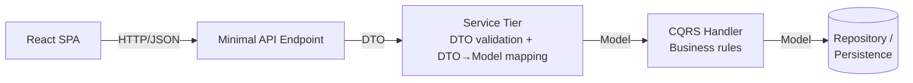
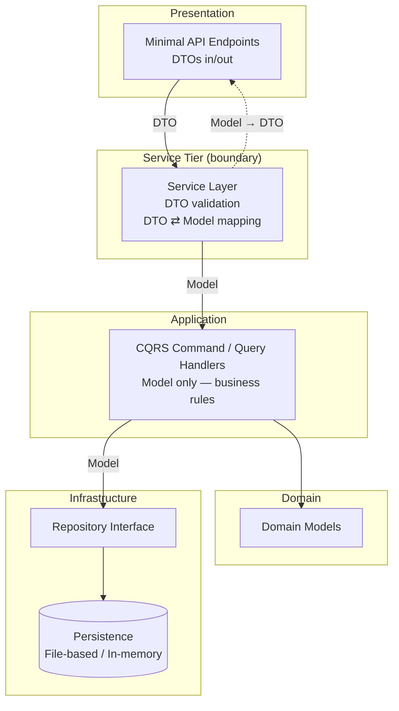

# Backend Architecture

Covers the ASP.NET Core Minimal API backend described in [`../overview-architecture.md`](../overview-architecture.md).

**Target framework: .NET 10** (current LTS release).

## Approach

- **Minimal API** — each endpoint is a small, single-responsibility handler (single responsibility principle applied at the endpoint level, not just the class level). No controller classes; each route maps directly to a thin handler that delegates out immediately.
- **CQRS** — commands and queries are separated, with no mediator library. See [`cqrs.md`](./cqrs.md) for the full pattern.
- **Two layers of validation, two different jobs:**
  - **Service tier (DTO-level validation):** shape/presence checks on the incoming request — is `title` present, is `dueDate` a parseable date, is the request well-formed. This is "is the request valid input," not "is this allowed."
  - **CQRS handlers (business logic / stricter rules):** domain rules enforced here — e.g. rules that depend on existing state or domain invariants, not just the shape of one request. This is "is this operation allowed to happen."
- **DTOs never cross below the service tier.** The service tier is the boundary: it validates the incoming DTO, then maps it to a domain Model before handing anything to CQRS. Commands, queries, handlers, and the repository/persistence layer only ever see Models — never the API's DTO types. This keeps the API contract (DTO shape) decoupled from the domain model, so either can change without forcing a change in the other.

The split matters because it keeps cheap, request-shaped checks (DTO validation) from being tangled up with the kind of check that needs to know about the rest of the system (business rules). Endpoint handlers stay dumb; CQRS handlers stay focused on one command or query each, working only with domain Models.

## Directory Structure

Modular monolith: a thin **Gateway** host project references one **class library per feature**. Same shape I use for multi-service work — designed as a monolith first, but the feature boundary already exists as a project reference, so a feature can be pulled out into its own service later without restructuring, if that's ever needed. Right now there's one feature (Todos), so the payoff is mostly about not having to restructure later, not about splitting anything today.

```text
backend/
├── TodoApi.slnx                          # .slnx (XML), not the classic GUID-heavy .sln — diff-friendly
├── src/
│   ├── TodoApi.Gateway/                  # thin host — API entry point, no feature logic
│   │   ├── Program.cs
│   │   ├── ConfigureServices.cs
│   │   ├── ConfigureApps.cs
│   │   ├── Endpoints.cs                  # registration index only, see Endpoint Pattern below
│   │   ├── openapi.json                  # generated spec output, see API Contract / OpenAPI below
│   │   └── TodoApi.Gateway.csproj
│   │
│   └── TodoApi.Todos/                    # feature library — everything Todos-specific
│       ├── Endpoints/
│       │   ├── AddTodoEndpoint.cs
│       │   ├── ListTodosEndpoint.cs
│       │   ├── GetTodoByIdEndpoint.cs
│       │   ├── UpdateTodoEndpoint.cs
│       │   ├── CompleteTodoEndpoint.cs
│       │   ├── IncompleteTodoEndpoint.cs
│       │   └── DeleteTodoEndpoint.cs
│       ├── Commands/                     # CQRS commands + handlers, one file each — see cqrs.md
│       │   ├── AddTodoCommand.cs
│       │   ├── UpdateTodoCommand.cs
│       │   ├── CompleteTodoCommand.cs
│       │   ├── IncompleteTodoCommand.cs
│       │   └── DeleteTodoCommand.cs
│       ├── Queries/                      # CQRS queries + handlers — see cqrs.md
│       │   ├── ListTodosQuery.cs
│       │   └── GetTodoByIdQuery.cs
│       ├── Models/
│       │   └── TodoModel.cs
│       ├── Persistence/                  # repository interface + EF Core implementation, see Persistence below
│       │   ├── ITodoRepository.cs
│       │   ├── TodoRepository.cs
│       │   ├── TodoDbContext.cs
│       │   └── Migrations/               # EF Core migrations
│       ├── TodoMappingConfig.cs          # IRegister, see Mapping section above
│       ├── Extensions/
│       │   └── ServiceCollectionExtensions.cs  # AddTodosServices(), pulled into Gateway's ConfigureServices
│       └── TodoApi.Todos.csproj
│
└── tests/
    ├── TodoApi.Todos.Tests/
    └── TodoApi.Gateway.Tests/            # host-level/integration tests, if any
```

See [`../overview-architecture.md#repo-layout`](../overview-architecture.md#repo-layout) for where `backend/` sits relative to `frontend/` and the rest of the repo.

**Persistence lives inside `TodoApi.Todos`** (a `Persistence/` folder), not a separate `TodoApi.Data` project — with a single feature, a standalone data project would be ceremony with no payoff since nothing else needs to share it. Worth revisiting only if a second feature needs to share the same `DbContext`.

## Persistence

**EF Core + SQLite.** The requirements doc says file-based storage or an in-memory store is sufficient — a full database isn't required. EF Core is a deliberate choice beyond that minimum, to demonstrate real ORM usage (DbContext, migrations, change tracking, LINQ queries) rather than the simplest thing that satisfies the requirement. SQLite keeps that choice compatible with "file-based storage is sufficient": the whole database is one file, no separate DB server to run or deploy.

Considered and ruled out:

- **Hand-rolled file-based storage (JSON/CSV)** — satisfies the requirements literally, but doesn't demonstrate anything about EF Core, data modeling, or migrations.
- **EF Core In-Memory provider** — satisfies "in-memory store is acceptable" literally, but Microsoft explicitly documents it as unsuited for real application use (no real relational semantics, some LINQ translations behave differently from a real provider) — it's a testing tool, not a persistence choice for a running app.
- **EF Core + Postgres/SQL Server** — a real server-based database is feasible given the home lab, but adds real infra (a running DB service, connection management, backups) beyond what this project's scope calls for.

### Repository shape

`ITodoRepository` is a thin wrapper directly over `TodoDbContext`/`DbSet<TodoModel>` — no separate Unit of Work abstraction on top. `DbContext` already *is* a unit of work (it tracks changes and commits them together via `SaveChangesAsync`), so adding another layer on top would duplicate what EF Core already provides. Appropriate because there's a single entity and no cross-repository transactions to coordinate; would be worth revisiting only if a second feature's repository needed to commit alongside `ITodoRepository` in the same transaction.

```csharp
public interface ITodoRepository
{
    Task<TodoModel> AddAsync(TodoModel todo, CancellationToken cancellationToken);
    Task<TodoModel?> GetByIdAsync(Guid id, CancellationToken cancellationToken);
    Task<IReadOnlyList<TodoModel>> ListAsync(CancellationToken cancellationToken);
    Task<TodoModel?> UpdateAsync(TodoModel todo, CancellationToken cancellationToken);
    Task<bool> DeleteAsync(Guid id, CancellationToken cancellationToken);
}

public sealed class TodoRepository(TodoDbContext dbContext) : ITodoRepository
{
    public async Task<TodoModel> AddAsync(TodoModel todo, CancellationToken cancellationToken)
    {
        dbContext.Todos.Add(todo);
        await dbContext.SaveChangesAsync(cancellationToken);
        return todo;
    }

    public Task<TodoModel?> GetByIdAsync(Guid id, CancellationToken cancellationToken) =>
        dbContext.Todos.FirstOrDefaultAsync(t => t.Id == id, cancellationToken);

    // ListAsync / UpdateAsync / DeleteAsync follow the same shape —
    // EF Core specifics fully contained here, CQRS handlers only see ITodoRepository.
}
```

### Migrations

Applied automatically at app startup (`dbContext.Database.Migrate()`, called from `ConfigureApps`), not via a separate CI/CD or manual step. Simplest option for a single-deployment demo app — no extra pipeline step to remember, no risk of forgetting to migrate before a demo. This trades away the safety a separate migration step gives on a multi-replica production deployment (avoiding two instances racing to migrate at once); not a concern here since the demo runs a single replica.

### Where the SQLite file lives

For the home-lab Kubernetes demo deployment (see [`../../infra/deployment.md`](../../infra/deployment.md)), the SQLite file is written to a path backed by a **PersistentVolume**, not the container's own ephemeral filesystem — otherwise the to-do list would reset every time the pod restarts or redeploys. This needs a small addition to `deployment.md`'s still-TODO Cluster/Ingress section once that's worked out (a PVC mount and the connection string pointing at it).

Locally, the file just lives on disk in the working directory (or a configured path) — no PVC needed outside the cluster.

## Mapping (DTO ⇄ Model)

**Not using AutoMapper** — as of late 2024 AutoMapper requires a paid commercial license for new/updated versions, which isn't appropriate to pull into this project.

Using **Mapster** instead, specifically via **`Mapster.SourceGenerator`** — a Roslyn incremental source generator, not Mapster's default runtime-reflection mode and not the older `Mapster.Tool` CLI codegen path. Considered three options:

1. **Mapster default (runtime-reflection/compiled-expression-tree mode)** — ruled out. Still reflection-based under the hood (compiled + cached expression trees), not true build-time codegen, not inspectable as generated C#.
2. **`Mapster.Tool` (CLI codegen)** — ruled out for this project. Requires a separate `dotnet mapster` invocation (or a wired-up pre-build step) to emit `.g.cs` files that get committed to the repo. More visible/`git diff`-able, but an extra manual step to keep in sync.
3. **`Mapster.SourceGenerator` (chosen)** — a proper Roslyn incremental source generator, same category as Mapperly. Runs automatically on every build, no separate CLI step, always in sync with source. Generated code lives under `obj/generated` (viewable via the IDE's generated-file view, not committed to the repo) — same tradeoff profile as any other source generator in the project.

This keeps the property we want from any mapper here — no runtime reflection, mapping code is real compiler-generated C# — while staying free, MIT-licensed, and zero-maintenance to keep in sync (unlike the CLI path).

- DTO → Model and Model → response-DTO mappings are defined via Mapster's config (`TypeAdapterConfig`) or `[AdaptTo]`/`[AdaptFrom]`-style attributes, and the actual mapping methods are generated at build time.
- Call sites use the generated `Adapt<T>()` extension method (e.g. `request.Adapt<TodoModel>()`) — same call-site ergonomics as AutoMapper's `Map<T>()`, but backed by generated code instead of a runtime mapper instance, so no `IMapper` service needs to be injected.
- Only trivial, mostly 1:1 mappings are expected here (DTO fields to Model fields, same names) — if a mapping ever needs real logic, that logic belongs in the service tier or the mapping config, not smuggled into a handler.

**Convention:** one `IRegister` mapping config class per feature, named `{Feature}MappingConfig`, living alongside that feature's endpoints (not in a separate top-level `Mapping/` folder) — e.g. `TodoMappingConfig` next to the `Todos` endpoint classes. Keeps a feature's HTTP shape, mapping rules, and business logic co-located rather than spreading one feature across parallel folder hierarchies.

Example shape (illustrative — the mapping rules and class contents are a sketch, package reference/version still TODO once the project skeleton exists, see Open Questions):

```csharp
// TodoMappingConfig.cs — defines the mapping rules; Mapster.SourceGenerator
// generates the actual mapper implementation from this at build time.
public class TodoMappingConfig : IRegister
{
    public void Register(TypeAdapterConfig config)
    {
        config.NewConfig<AddTodoEndpoint.Request, TodoModel>()
            .Map(dest => dest.Id, src => Guid.NewGuid())
            .Map(dest => dest.CreatedAt, src => DateTimeOffset.UtcNow)
            .Map(dest => dest.IsCompleted, src => false);

        config.NewConfig<TodoModel, AddTodoEndpoint.Response>();
    }
}
```

```csharp
// Call site — same shape whether the mapping is a straight 1:1 property copy
// (Model -> Response above) or needs field-level rules (Request -> Model above).
var model = request.Adapt<TodoModel>();
var response = result.Adapt<AddTodoEndpoint.Response>();
```

`Mapster.SourceGenerator` picks up every `IRegister` implementation in the project as a Roslyn incremental generator step and emits the mapper implementation at compile time, so `.Adapt<T>()` calls resolve to generated code rather than doing reflection at runtime — no separate build step, no generated files to commit.

## Endpoint Pattern

Reusing a pattern I've used before on another Minimal API project: each endpoint is its own class, not a controller action. One class = one route = one responsibility.

- Each endpoint class implements a shared `IEndpoint` interface with a static `Map(IEndpointRouteBuilder app)` method that registers its own route, name, and DTO validation filter.
- The endpoint's `Request`/`Response` records and its `RequestValidator` (DTO-level validation) live right next to the `Map`/`Handle` methods, in the same file — everything about "how this one HTTP call is shaped" stays together.
- The `Handle` method is a thin static handler: bind request → call the CQRS command/query handler → map the result to a typed HTTP response (`TypedResults.Ok`, `TypedResults.NotFound`, etc.) → done. No business logic here.
- Endpoints are grouped by feature and registered from a single place (`app.MapGroup("/todos")...MapEndpoint<AddTodoEndpoint>()...`), so the route table is readable in one spot without hunting through controller classes.

Each CRUD/status operation (Add, List, View, Update, Complete, Incomplete, Delete) gets its own endpoint class under this pattern, rather than one `TodosController` with seven actions.

Example shape (illustrative, not final):

```csharp
public class AddTodoEndpoint : IEndpoint
{
    public static void Map(IEndpointRouteBuilder app) =>
        app.MapPost("/", Handle)
            .WithName("AddTodo")
            .WithSummary("Add a new to-do item")
            .AddEndpointFilter<ValidationFilter<Request>>();

    public record Request(string Title, string? Description, DateOnly? DueDate);

    public record Response(Guid Id, string Title, string? Description, DateOnly? DueDate, bool IsCompleted, DateTimeOffset CreatedAt);

    public class RequestValidator : AbstractValidator<Request>
    {
        public RequestValidator()
        {
            RuleFor(x => x.Title).NotEmpty();
        }
    }

    private static async Task<Results<Created<Response>, ValidationProblem>> Handle(
        [FromBody] Request request,
        [FromServices] IAddTodoCommandHandler handler, // named interface, see cqrs.md
        CancellationToken cancellationToken)
    {
        // DTO -> Model mapping happens here, at the service tier boundary,
        // via a Mapster-generated extension method (see Mapping section below).
        // The CQRS handler below only ever sees TodoModel, never Request/Response.
        var model = request.Adapt<TodoModel>();

        var result = await handler.HandleAsync(new AddTodoCommand(model), cancellationToken);

        var response = result.Adapt<Response>();
        return TypedResults.Created($"/todos/{response.Id}", response);
    }
}
```

### `Endpoints.cs` — the route registration index

Each endpoint class owns its own route (via its `Map` method), but something still has to call `Map` for every one of them at startup. That's the only job of `Endpoints.cs`: it's a single, static file that registers every endpoint onto the app, grouped by feature/route prefix. It holds no request handling, no validation, no business logic — just the list of "these are all the endpoints that exist, and here's the route group each one lives under."

Having one file like this means the full route table is visible in one place without opening every endpoint class, while the endpoint classes themselves stay independent and self-contained.

```csharp
public static class Endpoints
{
    public static void MapEndpoints(this WebApplication app)
    {
        var todos = app.MapGroup("/todos")
            .WithTags("Todos");

        todos
            .MapEndpoint<AddTodoEndpoint>()
            .MapEndpoint<ListTodosEndpoint>()
            .MapEndpoint<GetTodoByIdEndpoint>()
            .MapEndpoint<UpdateTodoEndpoint>()
            .MapEndpoint<CompleteTodoEndpoint>()
            .MapEndpoint<IncompleteTodoEndpoint>()
            .MapEndpoint<DeleteTodoEndpoint>();
    }

    private static IEndpointRouteBuilder MapEndpoint<TEndpoint>(this IEndpointRouteBuilder app)
        where TEndpoint : IEndpoint
    {
        TEndpoint.Map(app);
        return app;
    }
}
```

`ConfigureApps.Configure()` calls `app.MapEndpoints()` once during pipeline setup — see Bootstrapping below.

## Bootstrapping

App startup logic is split across two static classes, keeping `Program.cs` itself minimal:

- **`ConfigureServices`** — everything that registers services into the DI container (`builder.Services.Add...`): persistence/repository registration, validators, CORS policy, Swagger, logging. One method (`AddServices(this WebApplicationBuilder builder)`) as the entry point, broken into small private helpers per concern.
- **`ConfigureApps`** — everything that builds the middleware pipeline on the built `WebApplication` (`app.Use...`, `app.Map...`): Swagger UI, CORS, endpoint mapping. One method (`Configure(this WebApplication app)`) as the entry point.

`Program.cs` itself just does `builder.AddServices()` → `builder.Build()` → `app.Configure()` → `app.Run()`. Keeps startup wiring out of the file that's supposed to just be the entry point, and keeps "what's registered" separate from "what's in the pipeline."

## Request Flow



1. Endpoint receives the HTTP request, binds it to a DTO.
2. Service tier validates the DTO (required fields, format) — rejects early with `400` if invalid.
3. Service tier maps the validated DTO to a domain Model.
4. Service tier dispatches a command or query — built from the Model, not the DTO — to its CQRS handler.
5. CQRS handler applies business rules against the Model, talks to the repository/persistence layer (also Model-typed).
6. Result flows back up through the service tier, which maps the resulting Model back to a response DTO, to the endpoint, which maps it to an HTTP response.

Full detail on how commands/queries are dispatched (no mediator library) is in [`cqrs.md`](./cqrs.md).

## Layered View (N-Tier)

The DTO/Model split above is really about which types are allowed to exist at each layer. Everything at or below the service tier only knows about domain Models — the DTO is strictly an API-contract type that lives at the edge.



- **Presentation (Endpoints):** only tier that knows about DTOs and HTTP concerns (status codes, routes).
- **Service Tier:** the boundary/translation layer — DTO validation, and the only place DTO ⇄ Model mapping happens.
- **Application (CQRS):** business rules, working exclusively in domain Models. No knowledge of DTOs or HTTP. See [`cqrs.md`](./cqrs.md) for the dispatch mechanism.
- **Domain:** the Model types themselves — plain, framework-agnostic where possible.
- **Infrastructure (Repository/Persistence):** also Model-typed; swapping file-based for in-memory (or a real DB later) shouldn't ripple up past this layer.

## Open Questions / TODO

- Exact command/query list per CRUD operation (Add, Update, Complete, Incomplete, Delete → commands; List, View → queries) — needs to be enumerated.
- `IEndpoint` interface shape and shared endpoint-mapping helper — needs to be defined for this project (not carried over verbatim from prior work, just the pattern).
- Persistence mechanism is decided: EF Core + SQLite (see Persistence section above). SQLite package/connection string configuration, exact PVC mount path for the home-lab deployment, and local dev file path are not yet finalized.
- Testing strategy per layer (service tier vs CQRS handlers vs repository) — not yet written up.
- `Mapster.SourceGenerator` NuGet package reference/version — naming convention and folder placement for `IRegister` config classes are decided (see Mapping section above); the package reference itself gets pinned once the project skeleton exists.
- CQRS dispatch mechanism specifics — see [`cqrs.md`](./cqrs.md) Open Questions.

## Error Response Contract

Decided: use ASP.NET Core's built-in RFC 9457 Problem Details format for all error responses — `TypedResults.NotFound()`, `TypedResults.Problem(...)`, `TypedResults.ValidationProblem(...)`, with `app.UseExceptionHandler()` catching unhandled exceptions as 500-level Problem Details. No custom error DTO. Full detail in [`../../standards/aspnet-web-api-guidelines.md`](../../standards/aspnet-web-api-guidelines.md#error-responses).

This was an open question sent to Foci (see [`../../requirements/requirements-qa.md`](../../requirements/requirements-qa.md)) — Problem Details is a reasonable, framework-native default regardless of their answer, so it's safe to build against now rather than wait.

## API Contract / OpenAPI

Endpoint metadata (`.WithName()`, `.WithSummary()`, request/response types) feeds `Microsoft.AspNetCore.OpenApi`'s spec generation directly — the OpenAPI spec is generated from the endpoints themselves, not maintained by hand. Generated at **build time** (via `Microsoft.Extensions.ApiDescription.Server`, not `Microsoft.AspNetCore.OpenApi`'s runtime-only default) into `TodoApi.Gateway/openapi.json`, committed to the repo. See [`../overview-architecture.md#api-contract--client-generation`](../overview-architecture.md#api-contract--client-generation) for the full spec-to-TypeScript-client pipeline (orval) and why build-time generation was chosen over serving the spec live.

### Interactive UI for manual testing

**Scalar** (`Scalar.AspNetCore`, `app.MapScalarApiReference()`), Development-only, served alongside the raw spec at `MapOpenApi()`. Chosen over Swashbuckle's Swagger UI: the project already uses the built-in `Microsoft.AspNetCore.OpenApi` generator (not Swashbuckle's), and Microsoft's own docs point to Scalar as the successor now that Swagger UI was dropped from the default .NET template — wiring in Swashbuckle just for its UI half would mean carrying a second, redundant spec generator. Gated to Development in `ConfigureApps` alongside `MapOpenApi()` — not exposed in the home-lab demo deployment.

## Related Docs

- [`../overview-architecture.md`](../overview-architecture.md) — system-level overview, including the OpenAPI/client-generation pipeline
- [`cqrs.md`](./cqrs.md) — CQRS pattern without a mediator library
- [`../authentication.md`](../authentication.md) — auth is out of scope for phase 1; this doc assumes single-user
- [`../../requirements/requirements.md`](../../requirements/requirements.md) — source requirements
- [`../../requirements/requirements-qa.md`](../../requirements/requirements-qa.md) — open questions sent to Foci
