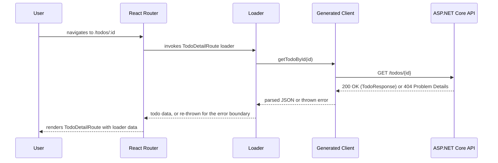

# Frontend Architecture

Covers the React SPA described in [`../overview-architecture.md`](../overview-architecture.md). Backend is fully built (all six endpoints — see [`../backend/overview.md`](../backend/overview.md)); this doc plans the frontend against that already-shipped, already-committed API contract, not a moving target.

**Stack: Vite + React + TypeScript, React Router (data APIs), Tailwind CSS, Vitest + React Testing Library.**

## Approach

- **React Router's data APIs (loaders/actions) are the data layer — no separate state-management or data-fetching library.** A route's `loader` fetches what that route needs before it renders; a route's `action` handles the corresponding form submission (add/update/delete/complete). Router re-runs the loader after an action completes, so the list view refreshes itself after a mutation with no manual cache invalidation or "refetch" call to wire up. This was chosen over adding a query library (e.g. TanStack Query) specifically because it's a capability of a dependency already committed to (React Router itself, per [`../overview-architecture.md`](../overview-architecture.md)), not a new one to learn, explain, and justify in the README for a six-endpoint CRUD app. Revisit only if the data-fetching needs grow past what loaders/actions comfortably express (e.g. real-time updates, complex cross-route cache sharing) — not a need this app has.
- **No global client-state store (Redux/Zustand/Context-as-store).** Server state (the todo list) lives in loader data, which React Router already caches per-route; there is no other cross-cutting client state in this app (no auth session, no theme, no multi-step wizard) that would justify one. `useState` is enough for local, component-scoped UI state (an open/closed form, an input's current value before submit).
- **Tailwind CSS, not a component library.** Considered Ant Design (familiar from prior work) and MUI — both ruled out as more dependency than a to-do list's form/list/button surface needs, and the requirements explicitly de-emphasize visual polish (see [`../../requirements/requirements.md`](../../requirements/requirements.md#overview)). Tailwind styles plain semantic HTML with utility classes; no component API to learn, configure, or explain. Same "don't add ceremony the project doesn't need" reasoning the backend doc already applies to AutoMapper/MediatR/Mapster.
- **Generated API client only — no hand-written `fetch` calls.** orval generates a typed client (functions + TypeScript types) from the backend's committed `openapi.json` as a frontend pre-build step. Loaders and actions call the generated functions directly; nothing in the app constructs a request URL or parses a response body by hand. See [API Contract & Client Generation](#api-contract--client-generation) below.

## Directory Structure

```text
frontend/
├── index.html
├── vite.config.ts
├── tailwind.config.ts
├── tsconfig.json
├── package.json
├── orval.config.ts                       # points at ../backend/src/TodoApi.Gateway/openapi.json
├── src/
│   ├── main.tsx                          # ReactDOM.createRoot + RouterProvider
│   ├── router.tsx                        # createBrowserRouter — route tree, loaders/actions wired per route
│   ├── api/
│   │   └── generated/                    # orval output — committed, not hand-edited, regenerated on build
│   │       ├── todos.ts                  # typed client functions (listTodos, addTodo, updateTodo, ...)
│   │       └── models/                   # TypeScript types generated from the OpenAPI schemas
│   ├── routes/
│   │   ├── TodoListRoute.tsx             # "/" — loader: listTodos; renders the list + add form
│   │   ├── TodoListRoute.loader.ts
│   │   ├── TodoListRoute.action.ts       # handles the add-todo form submission
│   │   ├── TodoDetailRoute.tsx           # "/todos/:id" — loader: getTodoById; view + edit + delete + complete
│   │   ├── TodoDetailRoute.loader.ts
│   │   ├── TodoDetailRoute.action.ts     # handles update / complete-incomplete / delete for this todo
│   │   └── ErrorBoundary.tsx             # routeErrorElement — renders thrown Problem Details / not-found
│   ├── components/
│   │   ├── TodoList.tsx                  # presentational — renders an array of todos (Title/DueDate/Status)
│   │   ├── TodoForm.tsx                  # shared add/edit form (title, description, dueDate fields)
│   │   └── TodoStatusToggle.tsx          # complete/incomplete control
│   ├── lib/
│   │   └── problemDetails.ts             # narrows a caught error to RFC 9457 shape, extracts message(s)
│   └── styles/
│       └── index.css                     # Tailwind directives only
└── tests/
    ├── setup.ts                          # RTL/jest-dom setup, MSW server lifecycle hooks
    ├── mocks/
    │   └── handlers.ts                   # MSW request handlers stubbing the generated client's endpoints
    ├── routes/
    │   ├── TodoListRoute.test.tsx
    │   └── TodoDetailRoute.test.tsx
    ├── components/
    │   ├── TodoList.test.tsx
    │   └── TodoForm.test.tsx
    └── lib/
        └── problemDetails.test.ts
```

See [`../overview-architecture.md#repo-layout`](../overview-architecture.md#repo-layout) for where `frontend/` sits relative to `backend/`.

**One route pair per screen, one file per concern within it** — a route component (`.tsx`), its loader, and its action are separate files rather than all colocated in one, unlike the backend's endpoint-per-file pattern. React Router's convention (and most examples/tooling) treats loader/action as named exports importable independently of the component, and keeping them in separate files makes each one easier to unit test in isolation (a loader is just an async function; it doesn't need React Testing Library to test). This is a deliberate divergence from the backend's "everything about one HTTP call lives in one file" rule, not an oversight — the backend's Request/Response/Validator all describe the *same* HTTP contract, where a route's component/loader/action are three different concerns (rendering, reading, writing) that happen to share a URL.

## Routes → Backend Operations

Two routes cover all seven requirement-level operations (Add, List, View, Update, Complete, Incomplete, Delete), matching how the backend already collapsed Complete/Incomplete into one endpoint:

| Route | Loader (read) | Action (write) | Backend operation(s) |
|---|---|---|---|
| `/` (`TodoListRoute`) | `listTodos()` → `GET /todos` | form submit → `addTodo()` → `POST /todos` | List, Add |
| `/todos/:id` (`TodoDetailRoute`) | `getTodoById(id)` → `GET /todos/{id}` | edit form → `updateTodo()` → `PUT /todos/{id}`; toggle → `updateCompletionStatus()` → `PATCH /todos/{id}`; delete button → `deleteTodo()` → `DELETE /todos/{id}` | View, Update, Complete, Incomplete, Delete |

**One action per route, dispatched by an intent field**, not one action per operation. React Router gives each route exactly one `action` export; a route with more than one kind of mutation (the detail route has three: update, toggle status, delete) distinguishes them via a hidden `intent` field in the submitted `FormData` (`formData.get("intent")`), then dispatches to the matching generated-client call inside that one action function. This mirrors the backend's own `UpdateCompletionStatusEndpoint` precedent (see [`../backend/overview.md#endpoint-pattern`](../backend/overview.md#endpoint-pattern)) of collapsing closely-related write operations into one handler rather than multiplying near-identical ones — same call, made at the routing layer instead of the endpoint layer.

**No standalone "add" or "edit" route.** The add form lives inline on `TodoListRoute`, and the edit form lives inline on `TodoDetailRoute` (toggled open/closed with local `useState`), rather than separate `/todos/new` and `/todos/:id/edit` routes. For a two-route app, a third and fourth route whose entire content is "the same form, submitting to a different action" is more routing surface than the app needs — revisit only if deep-linking directly to an open edit form becomes a real requirement.

## Data Flow (Read Path)



## Data Flow (Write Path)

```mermaid
sequenceDiagram
    participant User
    participant Form as TodoForm
    participant Router as React Router
    participant Action
    participant Client as Generated Client
    participant API as ASP.NET Core API

    User->>Form: submits (title, description, dueDate)
    Form->>Router: <Form method="post"> submission
    Router->>Action: invokes route action with FormData
    Action->>Client: addTodo(parsed request body)
    Client->>API: POST /todos
    API-->>Client: 201 Created or 400 ValidationProblem
    Client-->>Action: parsed JSON or thrown error
    Action-->>Router: redirect to new todo, or return validation errors
    Router-->>Form: re-renders with useActionData() errors, or navigates away
```



Client-side field validation (required `title`, max lengths) runs in `TodoForm` before submit purely for fast feedback — it is **not** the source of truth. The action still calls the generated client, which still hits the real backend validator; a `400 ValidationProblem` response is caught in the action and returned (not thrown) so `useActionData()` can surface field-level errors next to the form. This mirrors the backend's own two-tier validation split ([`../backend/overview.md`](../backend/overview.md#approach)): client-side checks are the UX layer, the server is still the actual authority, exactly as the backend treats its own DTO validation as "is this well-formed" rather than the final word.

## Error Handling

**RFC 9457 Problem Details, surfaced two different ways depending on where the error occurs**, matching the two different failure shapes the backend actually produces (see [`../backend/overview.md#error-response-contract`](../backend/overview.md#error-response-contract)):

- **Loader errors** (a `GET` failing — e.g. `404` on `/todos/:id` for a deleted/bad id) are thrown from the loader and caught by the route's `errorElement` (`ErrorBoundary.tsx`). React Router's error boundary model is a direct fit for "this whole screen can't render because the resource doesn't exist" — there is no partial page to show.
- **Action errors** (a `POST`/`PUT`/`PATCH` failing validation — a `400 ValidationProblem`) are caught *inside* the action and returned as data, not thrown, specifically so the form stays on screen with the user's input intact and per-field messages attached, via `useActionData()`. Throwing here would unmount the form the user was mid-filling-out, which is the wrong UX for "you typed something invalid," as opposed to "this resource doesn't exist."
- A shared `lib/problemDetails.ts` helper narrows a caught error/response to the RFC 9457 shape and extracts either the top-level `detail` (plain errors) or the `errors` field-message dictionary (`ValidationProblemDetails`), so both paths above parse the same way rather than each route hand-rolling its own Problem Details parsing.

**Implementation note: the generated client never throws.** orval's fetch client always resolves to `{ data, status, headers }`, even on a 404/400 — it does not reject the promise on a non-2xx status. This is because the backend's OpenAPI spec doesn't declare `ProblemDetails`/`ValidationProblemDetails` response schemas (ASP.NET Core's default `Microsoft.AspNetCore.OpenApi` generator doesn't emit them), so orval has no typed error shape to generate and types the error-status `data` as `void` — even though the real Problem Details JSON body is present on the wire at runtime. Loaders/actions therefore check `result.status` explicitly: a loader manually throws a `Response`/`Error` on a non-2xx status (so the `errorElement` model above still works exactly as designed), and an action manually returns the error data instead of throwing (so `useActionData()` still works as designed). `lib/problemDetails.ts` parses the response body's raw JSON structurally (looking for `title`/`status`/`errors` fields) rather than relying on the generated client's type, since that type does not reflect the real body shape here.

## API Contract & Client Generation

Already decided at the system level in [`../overview-architecture.md#api-contract--client-generation`](../overview-architecture.md#api-contract--client-generation) — this section is the frontend-side mechanics only.

- `orval.config.ts` points at the backend's committed `backend/src/TodoApi.Gateway/openapi.json` and generates into `src/api/generated/`.
- **Build wiring:** `npm run generate:api` runs orval, wired as a `predev`/`prebuild` script in `package.json` so it runs automatically before `vite dev`/`vite build` — not a manual step. Matches the backend's own build-time OpenAPI generation being automatic rather than opt-in.
- **Generated output is committed**, same rationale as the backend's `openapi.json`: drift is visible in review (a stale generated client shows up as an unexpected diff, or no diff when one was expected) rather than silently failing at generation time; and the frontend can be built/tested without the backend running, since it never needs to hit a live server to know the contract's shape.
- orval's plain **fetch client** mode is used (not its React Query hook mode), since there's no query library in this app to generate hooks for (see [Approach](#approach)) — plain async functions are what loaders/actions call directly.

## Styling

**Tailwind CSS**, utility classes on plain HTML elements — no component library. Considered and ruled out:

- **Ant Design** — familiar from prior work, but its data-table/date-picker/form-suite surface solves problems this app doesn't have (a list of items with three visible fields, one create/edit form). Pulling in a full admin-UI component library for that is more dependency than the problem justifies.
- **MUI** — same reasoning as Ant Design; comparable weight, comparable mismatch with a six-operation CRUD app.
- **Plain CSS / CSS Modules** — genuinely viable (zero dependency), but more hand-written layout/spacing code for the same visual result Tailwind gets from utility classes, with no offsetting benefit for an app this size.

No dark mode, no theming system, no design tokens — out of scope for an app where the requirements explicitly say visual polish isn't evaluated.

## Testing

Mirrors the backend's per-layer split ([`../backend/overview.md`](../backend/overview.md), [`../../standards/aspnet-web-api-guidelines.md`](../../standards/aspnet-web-api-guidelines.md)) as closely as the two stacks allow:

- **Vitest** — Vite-native test runner, shares `vite.config.ts`/TypeScript config with the app itself, no separate build pipeline for tests (the reason Jest was not considered).
- **React Testing Library** — renders components/routes and asserts on what a user would see (rendered text, form values, disabled/enabled controls), not on internal component state or implementation details.
- **MSW (Mock Service Worker)** intercepts HTTP calls made by the generated client during tests, standing in for the real backend — the frontend-side equivalent of the backend's `Mock<ITodoRepository>` (Moq) at the repository boundary. Chosen over mocking the generated client module directly (`vi.mock('../api/generated/todos')`) because MSW mocks at the network layer: the generated client's own fetch/parsing/error-throwing logic still runs for real, only the actual HTTP round-trip is stubbed — closer to the backend's own choice to keep JSON serialization real in `TodoApi.Gateway.Tests` while mocking only the repository underneath it.
- **What's unit-tested vs. route-tested:**
  - `lib/problemDetails.ts` and any other pure helpers: plain Vitest unit tests, no rendering involved.
  - `components/*`: RTL component tests in isolation (e.g. `TodoForm` renders its fields, calls its submit handler with the right values, shows a passed-in error message next to the right field).
  - `routes/*`: RTL tests rendering the route through a memory router (`createMemoryRouter`) with MSW stubbing the API, exercising the loader → render → user interaction → action → re-render cycle end-to-end within the test process. This is the closest frontend equivalent to the backend's `WebApplicationFactory` integration tests — same "exercise the real wiring, mock only the boundary" shape, at the network boundary instead of the repository boundary.
- **No Playwright / real end-to-end browser tests.** Considered — genuinely the closer equivalent to running the real app against the real backend — but ruled out for this project's time budget; the route-level RTL+MSW tests already exercise the full loader/action/render cycle, and standing up a real backend instance for E2E runs is more infrastructure than a take-home's evaluation criteria (architecture, testing, code quality — not exhaustive coverage) calls for. Revisit if the app grows past what the RTL layer can credibly cover.

## API Base URL & Local Dev Origin

The generated client (see [API Contract & Client Generation](#api-contract--client-generation)) needs to know where the backend actually lives, and the backend's CORS policy (see [`../backend/overview.md#bootstrapping`](../backend/overview.md#bootstrapping), first addressed in [`../../features/add-todo/spec.md#cors`](../../features/add-todo/spec.md#cors)) needs to allow whatever origin the frontend actually runs on — that origin was left as "whatever the frontend spec settles on" when the backend CORS policy was written, so it's settled here:

- **Base URL: `VITE_API_BASE_URL`**, a Vite env variable (`.env.development`, gitignored per-developer overrides allowed via `.env.development.local`) read at build time and baked into the generated client's request calls. Not hardcoded in `src/api/generated/`, since that directory is regenerated and shouldn't need hand-editing to point at a different backend.
- **Local dev origin: `https://localhost:5173`.** Per [`../../infra/deployment.md#tls`](../../infra/deployment.md#tls), the app never runs over plain HTTP in any environment — that constraint applies to the Vite dev server too, not just the backend. Vite's dev server is configured (`vite.config.ts`, `server.https`) to use the same ASP.NET Core dev HTTPS certificate (`dotnet dev-certs https`, exported once to a form Vite/Node can load) already used for the backend's own local HTTPS, rather than introducing a second, separate cert mechanism for the frontend alone. `VITE_API_BASE_URL=https://localhost:7020` (the Gateway's HTTPS dev port) in `.env.development`.
- This closes the loop the backend's `"Frontend"` CORS policy left open: it allows `https://localhost:5173` specifically (not plain `http://`), matching the origin above exactly, since CORS matches on scheme+host+port and a mismatch here (e.g. forgetting `https://`) is a broken-fetch bug that only shows up at runtime, not compile time.
- **Demo/production origin and base URL:** not decided here — same as the backend spec's own deferral, this depends on the still-TODO [`../../infra/deployment.md#environments`](../../infra/deployment.md#environments) (how the built SPA is actually served and at what hostname in the home-lab deployment). Settle both the CORS origin and `VITE_API_BASE_URL`'s production value together, in that doc, when the deployment story is written.

## Resolved / Open Questions

- **State management library** — resolved: none. React Router loader data + local `useState` covers everything this app needs (see [Approach](#approach)).
- **Form library** (e.g. React Hook Form) — resolved: not used. Two fields' worth of controlled inputs plus one hidden `intent` field per form doesn't justify a form library; plain controlled components are enough, and client-side validation is UX-only anyway (see [Data Flow (Write Path)](#data-flow-write-path)).
- **Route-level code splitting / lazy loading** — not addressed; two routes is not enough surface for splitting to matter. Revisit only if the route tree grows substantially.

## Related Docs

- [`../overview-architecture.md`](../overview-architecture.md) — system-level architecture, OpenAPI/client-generation pipeline
- [`../backend/overview.md`](../backend/overview.md) — backend design this SPA consumes; error contract, endpoint list
- [`../../requirements/requirements.md`](../../requirements/requirements.md) — source requirements, including the "functionality over visual polish" evaluation note
- Feature-level frontend docs — TBD, one per screen as implemented, mirroring [`../../features/`](../../features/)
