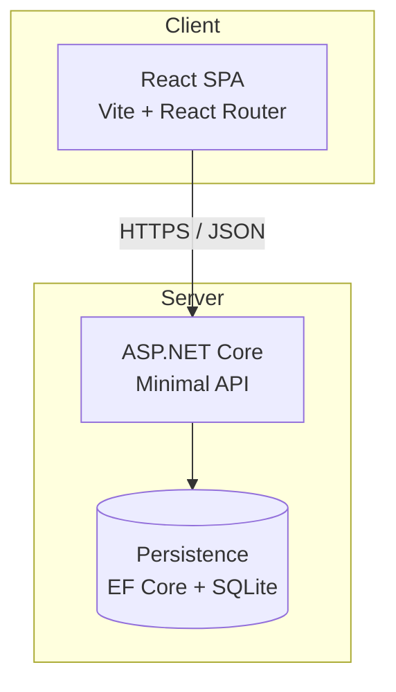
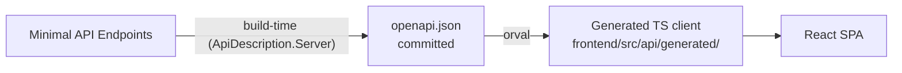

# TODO App High-level Architecture

This app is built to satisfy the Foci Solutions take-home coding challenge (see [`../requirements/requirements.md`](../requirements/requirements.md)). It's a to-do list application split into two independently deployable pieces: an ASP.NET Core Minimal API backend and a React SPA frontend, talking to each other over a JSON REST API. The backend owns the data model, validation, and persistence; the frontend is a thin client that renders the list, handles routing between views, and calls the API for every CRUD and status operation. This doc covers the system at a high level only — backend and frontend each get their own architecture doc, and individual features get their own doc as they're built out.

The diagram below assumes a single-user app with no auth layer — that's the baseline being built first. Multi-user support (with an auth/user-scoping component) is a stretch goal I may add if time allows; see [`../requirements/requirements-qa.md`](../requirements/requirements-qa.md) for the related question sent to Foci. If it gets built, this diagram and the backend doc will be updated to reflect it.

Containerization is an optional enhancement, not a core requirement, so it's not reflected in the diagram below. If it happens, the app gets built into a Docker image and pushed to a private Harbor registry — see [`../infra/harbor-registry-setup.md`](../infra/harbor-registry-setup.md) for that setup.

## Components



- **React SPA** — Vite-built React app using React Router's data APIs (loaders/actions) for routing and data fetching. Owns presentation only; no business logic beyond client-side validation feedback. See [`frontend/overview.md`](./frontend/overview.md) for the full design.
- **ASP.NET Core Minimal API** — Owns the to-do domain model, request validation, and status codes/error contract. Exposes REST endpoints under `/todos`.
- **Persistence** — EF Core + SQLite behind a repository interface (`ITodoRepository`), a deliberate choice beyond the requirements doc's "file-based or in-memory is sufficient" minimum, made to demonstrate real ORM usage. See [`backend/overview.md#persistence`](./backend/overview.md#persistence) for the full decision and what was ruled out.

## API Contract & Client Generation

The OpenAPI spec is the source of truth for the contract between backend and frontend — not hand-maintained on either side.

- **Spec generation (backend):** `Microsoft.AspNetCore.OpenApi` — the built-in .NET OpenAPI generator (introduced in .NET 9, still the built-in option on .NET 10 — see [`backend/overview.md`](./backend/overview.md) for the project's target framework), driven off the Minimal API endpoint metadata (`.WithName()`, `.WithSummary()`, etc. — see [`backend/overview.md`](./backend/overview.md#endpoint-pattern)). No extra dependency (ruled out Swashbuckle; more mature/customizable but an unnecessary dependency here).
  - **Build-time, not runtime.** By itself, `Microsoft.AspNetCore.OpenApi` only serves the spec live from a running app (`/openapi/v1.json`) — it does **not** write a file to disk by default. Build-time file output requires also referencing `Microsoft.Extensions.ApiDescription.Server` and enabling its MSBuild target (`<OpenApiGenerateDocumentsOnBuild>true</OpenApiGenerateDocumentsOnBuild>`, plus `<OpenApiDocumentsDirectory>`), which runs the app briefly during build and writes the spec to disk. This is what makes the committed-file plan below actually work — using `Microsoft.AspNetCore.OpenApi` alone would only support the "live backend" approach this doc explicitly ruled out.
- **Client generation (frontend):** [**orval**](https://orval.dev/) reads the OpenAPI spec and generates TypeScript types *and* callable client functions into the frontend's source tree (e.g. `frontend/src/api/generated/`) — no hand-written `fetch` calls for API access.
- **Generated client lives in-repo**, committed alongside hand-written frontend code — not published as a separate npm package. Right-sized for this project; a published package would be unnecessary ceremony for a single consumer.



**Why not `openapi-generator`:** considered — it's multi-language (TypeScript, C#, and dozens more from the same spec/config, which matters if a non-TS client is ever needed) and I've used it before in a real project, but it requires a JVM and produces heavier, more boilerplate-y generated code than necessary for a single-consumer TS client. Decision: use orval for now; only reach for `openapi-generator` if a genuine non-TypeScript client requirement shows up later — not a hypothetical one.

### Build Wiring

Generation is part of each build, not a manual step someone has to remember to run — a manual step means drift is invisible until someone notices the frontend calling a stale contract.

- **Backend build:** `Microsoft.Extensions.ApiDescription.Server`'s build-time generation (`OpenApiGenerateDocumentsOnBuild`) writes the spec to a known path on every `dotnet build` (`backend/src/TodoApi.Gateway/openapi.json` — see [`backend/overview.md`](./backend/overview.md#directory-structure)). That file is **committed to the repo**.
- **Frontend build:** runs orval against the committed spec file as a pre-build step (e.g. `npm run generate:api && vite build`), regenerating the TS client from whatever spec is currently checked in.

This was a deliberate choice over generating the spec live against a running backend:

- The frontend can build standalone — it never needs the backend actually running (important for CI, and for anyone only working on the frontend).
- Spec drift is visible: if the backend's contract changed but nobody rebuilt/recommitted `openapi.json`, that shows up as an obviously stale file in review, rather than silently failing at generation time.
- The small added cost — spec generation adds negligible time to the backend build, and the frontend gains a real build-order dependency on that committed file being current — is worth it for making regeneration automatic instead of a manual step someone has to remember.

## Repo Layout

```text
todo-app-code-challenge/
├── backend/                # ASP.NET Core Minimal API — see backend/overview.md
├── frontend/                # React SPA — frontend architecture doc TBD
├── docs/
├── scripts/
└── VERSION
```

`backend/` and `frontend/` are siblings at the repo root — matching the "two independently deployable pieces" framing above. See [`backend/overview.md`](./backend/overview.md#directory-structure) for the full `backend/` tree (Gateway + feature-library modular monolith).

## Related Docs

- [`../requirements/requirements.md`](../requirements/requirements.md) — source requirements from Foci
- [`../requirements/requirements-qa.md`](../requirements/requirements-qa.md) — open questions sent to Foci, including multi-user/auth
- [`../infra/harbor-registry-setup.md`](../infra/harbor-registry-setup.md) — Harbor registry setup, if containerization happens
- [`backend/overview.md`](./backend/overview.md) — backend design (Minimal API + CQRS), directory structure (Gateway + feature-library modular monolith)
- [`frontend/overview.md`](./frontend/overview.md) — frontend design: React Router data APIs (loaders/actions) as the data layer, no state-management library, Tailwind CSS, generated-client integration, Vitest + RTL + MSW testing
- Feature-level docs — TBD, one per feature as implemented
